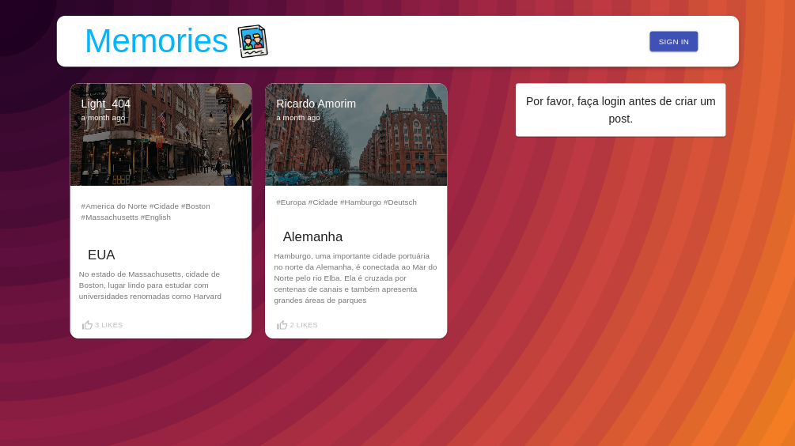

# Memories 🎞️ (Study Project)

- Acesse: https://memories-riickyhub.vercel.app/
- Projeto para estudo, foi criado com a intensão praticar minhas habilidades do back-end

## Screenshots 📷

## Stack utilizada 🧑‍💻

| Front-end               | Back-end                                                |
| ----------------- | ---------------------------------------------------------------- |
|  |  |
|   |  |
|  |  |
|  |  |
|  |  |
|  |  |

## Funcionalidades ⚙️

- Multiplataforma
- Autenticação de usuários
- Criar/Deletar/Atualizar apenas o próprio post
- Sistema de apenas um like por post para cada usuário
- Google AuthO2
- Armazenento de post e imagens no BD

## Referência 🔖

#### *- Tento fazer sempre meus projetos, respeitando a propriedade intelectual de seus devidos criadores*

### Estudo feito atráves desse vídeo(Youtube):  
- [JavaScript Mastery](https://www.youtube.com/watch?v=VsUzmlZfYNg&t=7226s&ab_channel=JavaScriptMastery)

## Feedback 📖

Se você tiver algum feedback, por favor nos deixe saber por meio de richardjosephace1960@gmail.com

